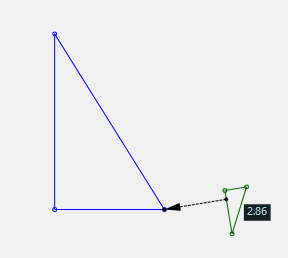
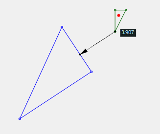
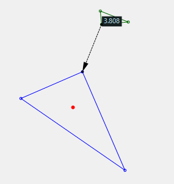

# HitTriangle

Demo code for minimum distance between triangles calculation.

## Examples

Here are some examples where one vertex is closest to the side of another triangle

**Figure 1**. Distance between a vertex and the side of a triangle.

**Figure 2**. Distance between a vertex and the side of the other  triangle.

**Figure 3**. Distance between two vertices on the two triangles.

## Algorithm

Finding the closest points between to triangles, involves the following steps

 1. Find closest points of triangle A to each of the following 6 geometries from triangle B
  - Take each vertex of triangle B and find the closest point to triangle A
    1. Find distances to each vertex of triangle A
    2. Find distances to each side of triangle A. 
    3. The closest point might be on the side, or on one of the ends of the sides
  - Take each side of triangle B and find the closest point to triangle A
    1. Find distances to each vertex of triangle A. The closest point might be on the side
       or on one of the ends
    2. Find distances of the ends of the sides to triangle A  
 2. Sort through each of the 6 distances and pick the smallest value
 3. Match the smallest value to the geometry element.
 4. Create a `Contact` object with the matching pair of closest points.

### Code Features

There are geometry objects defined for the following

 - `JA.Geometry.Triangle` a structure defined by three points.    
   - `.Contains(Vector2)` hit test if a point is inside the triangle
   - `.Offset(Vector2)` translate the triangle by a vector.
   - `.Rotate(Vector2,float)` rotate the triangle about a point.
   - `.GetClosestPoints(...)` get the contact pair with another geometry.
 - `JA.Geometry.Side` a structure defined by two points representing 
   a line segment, or the side of a triangle.
   - `.Tangent` the vector along the side
   - `.Normal` the vector normal to the side
   - `.Contains(Vector2)` hit test if a point is on the side
   - `.GetClosestPoints(...)` get the contact pair with another geometry.
   - `.Offset(Vector2)` translate the side by a vector
   - `.Rotate(Vector2,float)` rotate the side about a point
 - `JA.Geometry.Line` a structure defined by three values describing
    the coefficients `(a,b,c)` of the line equation `a*x+b*y+c=0`
   - `.Tangent` the vector along the line
   - `.Normal` the vector normal to the line
   - `.Contains(Vector2)` hit test if a point is on the line
 - `JA.Geometry.Contact` a structure representing the closest 
    points between two shapes.
   - `.Source` & `.Target` the points on each shape closest to the other shape
   - `.Distance` the minimal distance between two shapes
   - `.Direction` the contact direction pointing towards the target.
 - `JA.Geometry.LinearAlgebra` a static class with functions needed for vector 
    calculations and other helper functions.
     - `.Cross(Vector2,Vector2)` planar vector cross product
     - `.Join(Vector2,Vector3)` joins two points to form a line
     - `.Meet(Line,Line)` point where two lines meet
     - `.Project(Line,Vector2)` point on line closest to target point
     - `.Area(Triangle)` calculate area of triangle.

## Requirements

Built on `.NET Framework 4.8` using `System.Numerics` classes
and .NET 7.2+ features.

